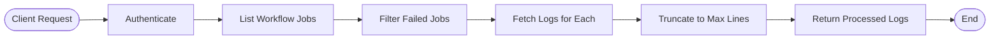

# Architecture

Understanding the internal architecture of AI Workflow Failure Summary Action.

## System Overview


## Component Architecture

### Core Components

#### 1. **Entry Point** (`src/index.ts`)


**Responsibilities:**
- Parse action inputs from workflow
- Get GitHub context (repo, run ID, etc.)
- Orchestrate the analysis workflow
- Handle errors and set outputs
- Create issues if requested

#### 2. **Analyzer** (`src/analyzer.ts`)


**Responsibilities:**
- Fetch workflow logs via GitHub API
- Load and process custom prompts
- Initialize appropriate LLM provider
- Format logs and prompts
- Invoke LLM for analysis
- Parse and return results

#### 3. **GitHub Client** (`src/github-client.ts`)



**Responsibilities:**
- Authenticate with GitHub API
- Fetch workflow run information
- Get logs for failed jobs
- Truncate logs to configured limit
- Create issues with analysis results

## Data Flow

### Log Processing Pipeline


### Prompt Resolution


## LLM Provider Architecture

### Provider Selection


### LLM Invocation


## State Management

The action is **stateless** - each execution is independent:


## Error Handling


**Error Handling Strategy:**
- All errors caught at entry point
- Specific error messages logged
- Action marked as failed with descriptive message
- No silent failures
- No partial outputs on error

## Security Architecture


**Security Measures:**
- Secrets never logged or exposed
- GitHub's automatic secret masking
- TLS for all external communication
- Authenticated API requests only
- Minimal permissions required
- No secret storage or persistence

## Performance Characteristics

### Time Complexity


**Average Execution Time:** 20-30 seconds
- Dominated by LLM API latency (10-20s)
- GitHub API calls: 3-5s
- Processing: <2s

### Resource Usage

- **Memory:** ~100MB (Node.js + dependencies)
- **CPU:** Minimal (I/O bound)
- **Network:** 
  - Logs download: varies by log size
  - LLM request: ~50KB (compressed)
  - LLM response: ~5-10KB

## Scalability


**Scalability Considerations:**
- Each workflow run is independent
- Parallel execution across repositories
- GitHub API rate limits apply
- LLM provider rate limits apply
- No shared state or bottlenecks

## Deployment Architecture


**Deployment Process:**
1. Code changes merged to main
2. `npm run build` compiles TypeScript
3. dist/ directory committed
4. Version tag created
5. Users reference tag in workflows

## Extension Points

Areas designed for customization:


## Technology Stack

```yaml
Runtime: Node.js 20
Language: TypeScript 5.3+
Framework: GitHub Actions Toolkit
LLM Integration: LangChain
Bundler: Vercel ncc
Dependencies:
  - @actions/core: GitHub Actions SDK
  - @actions/github: GitHub API client
  - @langchain/openai: OpenAI integration
  - @langchain/anthropic: Anthropic integration
  - @langchain/core: LangChain base types
```

## Future Architecture Considerations

Potential enhancements:

1. **Caching Layer**: Cache similar failures to reduce LLM calls
2. **Learning System**: Learn from resolved issues
3. **Multi-Step Analysis**: Chain multiple LLM calls
4. **Streaming Responses**: Stream LLM output for faster feedback
5. **Webhook Integration**: Push notifications to external systems

## Next Steps

<!-- - [Security Best Practices](security.md)
- [Troubleshooting Guide](troubleshooting.md) -->
- [Contributing Guide](../contributing.md)
