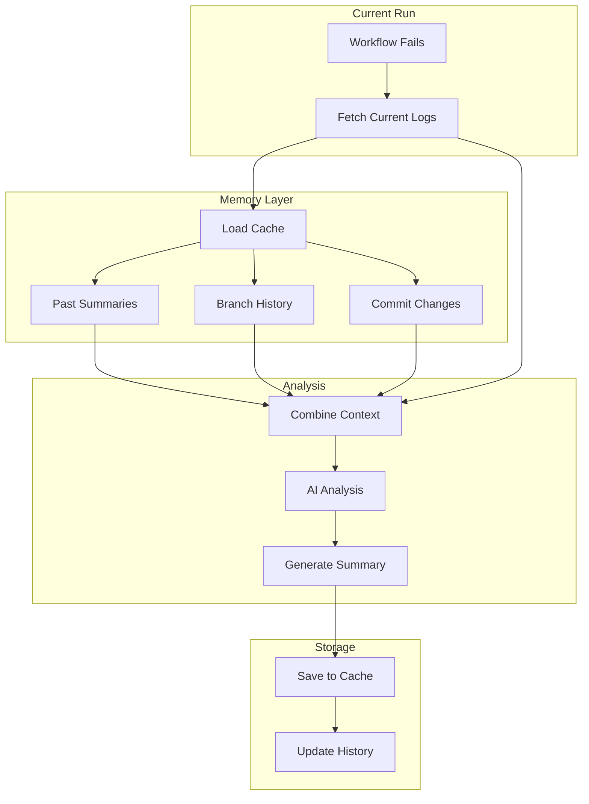

# Memory and Caching Features

## Overview

The AI Workflow Failure Summary Action now includes memory and caching capabilities to provide context-aware analysis by understanding:

- Past failed runs on the same branch
- Recent commit changes
- Previous AI summaries
- Historical failure patterns

## Architecture



## Cache Storage Options

### 1. GitHub Actions Cache (Recommended)

```yaml
- uses: ianlintner/ai_summary_action@v1
  with:
    github-token: ${{ secrets.GITHUB_TOKEN }}
    openai-api-key: ${{ secrets.OPENAI_API_KEY }}
    enable-memory: 'true'
    cache-strategy: 'actions-cache'
```

**Pros:**
- Built into GitHub Actions
- No external dependencies
- Automatic cleanup
- Cross-run persistence

**Cons:**
- 10GB limit per repository
- 7-day retention

### 2. GitHub Issues/Comments

```yaml
- uses: ianlintner/ai_summary_action@v1
  with:
    github-token: ${{ secrets.GITHUB_TOKEN }}
    openai-api-key: ${{ secrets.OPENAI_API_KEY }}
    enable-memory: 'true'
    cache-strategy: 'github-issues'
    memory-issue-label: 'ai-memory'
```

**Pros:**
- Permanent storage
- Easy to view and audit
- Integrates with GitHub UI

**Cons:**
- Creates issues/comments
- Requires issue write permissions
- Not as fast as cache

### 3. Git Notes

```yaml
- uses: ianlintner/ai_summary_action@v1
  with:
    github-token: ${{ secrets.GITHUB_TOKEN }}
    openai-api-key: ${{ secrets.OPENAI_API_KEY }}
    enable-memory: 'true'
    cache-strategy: 'git-notes'
```

**Pros:**
- Tied to commits
- Part of git history
- No extra storage needed

**Cons:**
- Requires push access
- Not visible in GitHub UI
- Complex to query

## Configuration

### Enable Memory

```yaml
enable-memory: 'true'
```

Enables all memory features.

### Cache Strategy

```yaml
cache-strategy: 'actions-cache' # or 'github-issues' or 'git-notes'
```

Choose how to store historical data.

### Memory Retention

```yaml
memory-retention-days: '30'
```

How long to keep historical data (default: 30 days).

### Max Historical Runs

```yaml
max-historical-runs: '10'
```

Maximum number of past runs to include in analysis (default: 10).

### Include Commit Changes

```yaml
include-commit-changes: 'true'
```

Include git diff of recent commits in analysis.

### Memory Scope

```yaml
memory-scope: 'branch' # or 'repository' or 'workflow'
```

Scope of memory to consider:
- `branch`: Only this branch's history
- `repository`: All branches
- `workflow`: Only this specific workflow

## What Gets Cached

### 1. Failure Summaries

```json
{
  "runId": 12345,
  "branch": "feature/fix-tests",
  "commit": "abc123",
  "timestamp": "2024-12-10T18:00:00Z",
  "summary": "Test failed due to...",
  "failedJobs": ["test", "lint"],
  "resolved": false
}
```

### 2. Branch History

```json
{
  "branch": "feature/fix-tests",
  "lastAnalysis": "2024-12-10T18:00:00Z",
  "totalFailures": 3,
  "commonErrors": [
    "DATABASE_URL not set",
    "Timeout in integration tests"
  ],
  "resolution": "Added DATABASE_URL to workflow"
}
```

### 3. Commit Changes

```json
{
  "commit": "abc123",
  "files": ["src/api.ts", "test/api.test.ts"],
  "additions": 50,
  "deletions": 20,
  "relevantTo": ["test job"]
}
```

## Enhanced Analysis Prompt

With memory enabled, the AI receives additional context:

```markdown
## Current Failure
[Current logs...]

## Historical Context

### Previous Failures on This Branch
1. 2 days ago: Test failed due to DATABASE_URL not set
   - Resolution: Added to workflow environment
   
2. 1 day ago: Build timeout
   - Resolution: Increased timeout from 10m to 15m

### Recent Commits
- abc123: "Fix database connection pooling" (2 files changed)
- def456: "Update test fixtures" (5 files changed)

### Patterns Detected
- This is the 3rd failure in the test job this week
- Similar error occurred 2 days ago
- Previous fix did not resolve the issue

## Analysis Request
Considering the history above, analyze the current failure and:
1. Identify if this is a recurring issue
2. Reference previous failures and resolutions
3. Determine if previous fixes were effective
4. Suggest improvements based on patterns
```

## Usage Examples

### Basic Memory Usage

```yaml
- uses: ianlintner/ai_summary_action@v1
  with:
    github-token: ${{ secrets.GITHUB_TOKEN }}
    openai-api-key: ${{ secrets.OPENAI_API_KEY }}
    enable-memory: 'true'
```

### Advanced Configuration

```yaml
- uses: ianlintner/ai_summary_action@v1
  with:
    github-token: ${{ secrets.GITHUB_TOKEN }}
    openai-api-key: ${{ secrets.OPENAI_API_KEY }}
    enable-memory: 'true'
    cache-strategy: 'actions-cache'
    memory-scope: 'branch'
    max-historical-runs: '20'
    memory-retention-days: '60'
    include-commit-changes: 'true'
```

### With Custom Prompts

```yaml
- uses: ianlintner/ai_summary_action@v1
  with:
    github-token: ${{ secrets.GITHUB_TOKEN }}
    openai-api-key: ${{ secrets.OPENAI_API_KEY }}
    enable-memory: 'true'
    custom-system-prompt: '.github/prompts/system-with-memory.md'
```

Example prompt:

```markdown
You are analyzing a workflow failure with access to historical context.

When analyzing:
1. Check if this error has occurred before
2. Review what previous fixes were attempted
3. Determine if patterns suggest a deeper issue
4. Provide more informed recommendations based on history

If this is a recurring issue, explain why previous fixes failed
and suggest a more permanent solution.
```

## API for Memory Access

The action exposes memory data as outputs:

```yaml
- id: analyze
  uses: ianlintner/ai_summary_action@v1
  with:
    enable-memory: 'true'
    # ...

- name: Access Memory Data
  run: |
    echo "Previous failures: ${{ steps.analyze.outputs.historical-failures }}"
    echo "Branch patterns: ${{ steps.analyze.outputs.branch-patterns }}"
    echo "Similar issues: ${{ steps.analyze.outputs.similar-issues }}"
```

## Benefits

### 1. Smarter Analysis

With historical context, the AI can:
- Identify recurring issues
- Suggest better fixes based on what didn't work
- Detect patterns across multiple failures
- Provide branch-specific insights

### 2. Reduced Repeated Failures

By understanding what was tried before:
- Avoid suggesting the same failed fix
- Recognize when a different approach is needed
- Learn from successful resolutions

### 3. Better Developer Experience

Developers get:
- More relevant recommendations
- Context about failure history
- Insight into patterns
- Confidence that issues won't recur

## Performance Considerations

### Cache Size

Each analysis typically stores:
- Summary: ~2-5 KB
- Commit changes: ~1-10 KB
- Metadata: ~1 KB

With 10 historical runs: ~50-150 KB total per branch

### Lookup Time

- Actions Cache: ~1-2 seconds
- GitHub Issues: ~2-5 seconds
- Git Notes: ~1-3 seconds

### Memory Usage

Minimal impact on action runtime:
- Loading cache: +1-3 seconds
- Processing history: +0.5-1 second
- Saving cache: +1-2 seconds

Total overhead: ~3-6 seconds per run

## Privacy and Security

### What's Stored

- Anonymized log summaries (not full logs)
- File paths and commit SHAs
- Error messages (sanitized)
- Job names and conclusions

### What's NOT Stored

- API keys or secrets
- Full log contents
- Sensitive environment variables
- Private code snippets

### Data Retention

- Automatic cleanup after retention period
- Manual clear via workflow dispatch
- Respects GitHub's data policies

## Clearing Memory

### Manual Clear

```yaml
- uses: ianlintner/ai_summary_action@v1
  with:
    github-token: ${{ secrets.GITHUB_TOKEN }}
    memory-action: 'clear'
    memory-scope: 'branch'  # or 'repository' or 'workflow'
```

### Automatic Cleanup

Memory is automatically cleaned:
- After retention period expires
- When branch is deleted (branch-scoped)
- When cache size limit is reached (LRU eviction)

## Troubleshooting

### Memory Not Loading

Check:
- `enable-memory: 'true'` is set
- Cache permissions are correct
- Cache exists (first run won't have memory)

### Out of Date Memory

Clear and rebuild:

```bash
# Via workflow
gh workflow run clear-memory.yml

# Or disable then re-enable
enable-memory: 'false'  # One run
enable-memory: 'true'   # Next run
```

### Performance Issues

Reduce historical data:

```yaml
max-historical-runs: '5'  # Default is 10
memory-retention-days: '14'  # Default is 30
```

## Future Enhancements

Planned features:
- Machine learning for pattern detection
- Cross-repository insights
- Predictive failure analysis
- Automatic resolution suggestions based on history
- Integration with GitHub Copilot Workspace

## Related Documentation

- [Configuration Reference](../configuration.md)
- [Architecture](architecture.md)
- [Custom Prompts](../usage/custom-prompts.md)
