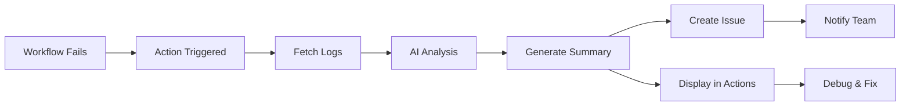
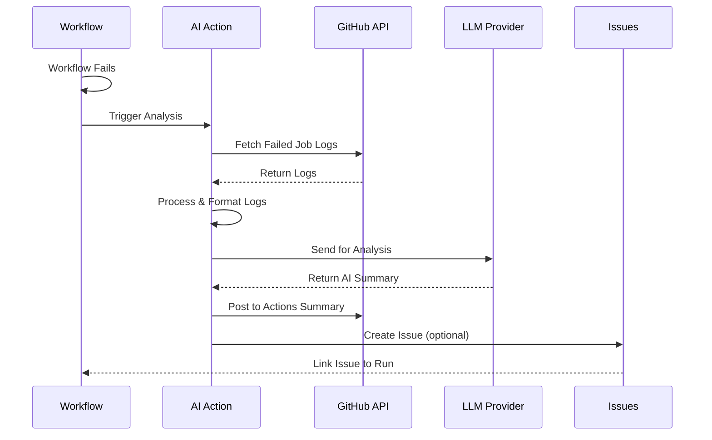

# AI Workflow Failure Summary Action

<div align="center">


**Intelligent debugging assistant for GitHub Actions**

[Quick Start](quickstart.md){ .md-button .md-button--primary }
[View on GitHub](https://github.com/ianlintner/ai_summary_action){ .md-button }

</div>

---

## Overview

AI Workflow Failure Summary Action is a powerful GitHub Action that automatically analyzes failed workflow runs using advanced AI models. It transforms cryptic error logs into clear, actionable summaries that help developers quickly understand and resolve issues.



## Key Features

### 🤖 **AI-Powered Analysis**
Uses state-of-the-art LLM models to understand failure context and provide intelligent insights beyond simple log parsing.

### 🔌 **Multiple LLM Providers**
Choose from OpenAI, Azure OpenAI, GitHub Models, or Anthropic Claude - whatever fits your needs and budget.

### 📊 **Actionable Insights**
Get structured summaries with:
- Root cause identification
- Specific error details and locations
- Step-by-step fix recommendations
- Related context and dependencies

### 🎯 **Seamless GitHub Integration**
- Automatic issue creation with formatted analysis
- Integration with GitHub Actions summary
- Works with GitHub Copilot for enhanced assistance

### 🔍 **Copilot Ready**
Output is optimized for GitHub Copilot, making it easy to:
- Get AI-powered fix suggestions
- Understand complex error patterns
- Navigate to problematic code sections

### ⚙️ **Highly Customizable**
- Custom prompt templates via `.github/prompts/`
- Configurable log line limits
- Flexible issue creation options
- Multiple output formats

## Why Use This Action?

**Before:**
```
Error: Command failed with exit code 1
npm ERR! code ELIFECYCLE
npm ERR! errno 1
[147 more lines of logs...]
```

**After:**
```markdown
## Summary
Your test suite failed due to a missing environment variable.

## Root Cause
The `DATABASE_URL` environment variable is not set in the workflow,
causing the database connection to fail during integration tests.

## Recommended Actions
1. Add DATABASE_URL to your workflow environment
2. Or add it to repository secrets
3. Ensure the test database is accessible from Actions runners

## Error Location
- File: test/integration/db.test.js:15
- Error: `DATABASE_URL is not defined`
```

## How It Works



## Quick Example

```yaml title=".github/workflows/ci.yml"
name: CI with AI Analysis

on: [push, pull_request]

jobs:
  test:
    runs-on: ubuntu-latest
    steps:
      - uses: actions/checkout@v4
      - run: npm test
  
  analyze-failure:
    if: failure()
    needs: [test]
    runs-on: ubuntu-latest
    steps:
      - uses: ianlintner/ai_summary_action@v1
        with:
          github-token: ${{ secrets.GITHUB_TOKEN }}
          llm-provider: 'openai'
          openai-api-key: ${{ secrets.OPENAI_API_KEY }}
          create-issue: 'true'
```

## What's Next?

<div class="grid cards" markdown>

-   :material-rocket-launch-outline: **[Quick Start Guide](quickstart.md)**

    Get up and running in 5 minutes with a drop-in workflow

-   :material-cog-outline: **[Configuration](configuration.md)**

    Learn about all available options and customization

-   :material-brain: **[Custom Prompts](usage/custom-prompts.md)**

    Tailor AI analysis to your specific needs and tech stack

-   :material-github: **[GitHub Copilot Integration](integrations/copilot.md)**

    Supercharge debugging with Copilot assistance

</div>

## Community & Support

- 📖 [Full Documentation](https://ianlintner.github.io/ai_summary_action)
- 🐛 [Report Issues](https://github.com/ianlintner/ai_summary_action/issues)
- 💡 [Request Features](https://github.com/ianlintner/ai_summary_action/issues/new)
- 🤝 [Contributing Guide](contributing.md)

## License

This project is licensed under the MIT License - see the [LICENSE](https://github.com/ianlintner/ai_summary_action/blob/main/LICENSE) file for details.
