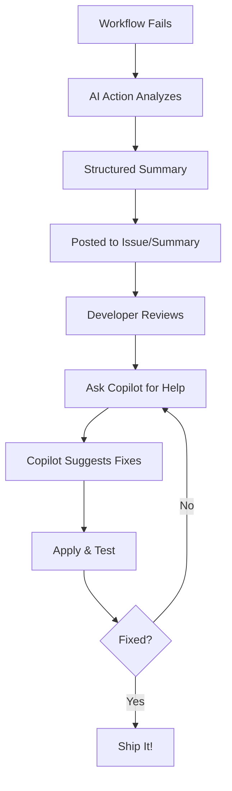

# GitHub Copilot Integration

Supercharge your debugging workflow by combining AI Workflow Failure Summary Action with GitHub Copilot.

## Overview

This action generates AI-powered failure analyses that are optimized for GitHub Copilot consumption. The structured output format makes it easy for Copilot to understand the context and provide intelligent suggestions.



## How It Works

### 1. Failure Analysis is Generated

When a workflow fails, the action creates a structured summary:

```markdown
## Summary
Test suite failed due to missing DATABASE_URL environment variable

## Root Cause
The integration tests require DATABASE_URL but it's not set in the workflow

## Error Location
- File: test/integration/db.test.js:15
- Error: DATABASE_URL is not defined

## Recommended Actions
1. Add DATABASE_URL to workflow environment
2. Configure in repository secrets
...
```

### 2. Copilot Understands the Context

GitHub Copilot can read:
- ✅ Issue descriptions created by the action
- ✅ GitHub Actions summary output
- ✅ Structured error details
- ✅ File paths and line numbers
- ✅ Recommended fix actions

### 3. Get AI-Powered Fix Suggestions

Ask Copilot questions like:

- "Review the latest workflow failure and suggest fixes"
- "Based on the AI analysis, how do I fix the DATABASE_URL error?"
- "Show me how to add environment variables to the workflow"
- "Create a fix for the issue #123 found by AI analysis"

## Usage Patterns

### In GitHub Issues

When `create-issue: true` is enabled, Copilot can read the issue directly:

=== "Via Copilot Chat"

    ```
    @workspace Review issue #42 and suggest how to fix the test failures
    ```

=== "Via Inline Chat"

    In VSCode, with the issue open in a browser:
    
    ```
    Ctrl+I (or Cmd+I): "Fix the errors described in GitHub issue #42"
    ```

=== "Via PR Comments"

    If the failure is on a PR:
    
    ```
    @copilot What changes do I need to make based on the AI failure analysis?
    ```

### In VSCode

#### Using Copilot Chat Panel

1. Open Copilot Chat (Ctrl+Shift+I / Cmd+Shift+I)
2. Reference the analysis:

```
@workspace The CI workflow failed with error in src/api/handler.ts
The AI analysis says there's a type mismatch. Can you show me the fix?
```

#### Using Inline Suggestions

With the analyzed file open:

```
// Copilot will suggest fixes based on:
// - The error location from AI analysis
// - The recommended actions
// - Your existing code context
```

### In GitHub Web UI

#### Reviewing PRs

1. PR fails and AI analysis runs
2. Analysis posted as comment or issue
3. Review the analysis in the PR
4. Ask Copilot: `@github-copilot[bot] suggest fixes for these failures`

#### In Actions Tab

1. Navigate to failed workflow run
2. View AI summary in the run summary
3. Copy relevant parts to Copilot
4. Get contextual help

## Optimizing for Copilot

### Use Structured Output

Ensure your custom prompts produce Copilot-friendly output:

```markdown title=".github/prompts/copilot-optimized.md"
Format your analysis for GitHub Copilot:

1. **Use Precise File References**: Always include full paths
   - Good: `src/components/Button.tsx:45`
   - Bad: "in the Button component"

2. **Include Code Snippets**: Show the problematic code
   ```typescript
   // Current (broken):
   const result = await fetch(url)
   
   // Should be:
   const result = await fetch(url).then(r => r.json())
   ```

3. **Provide Diff Format**: Show exact changes needed
   ```diff
   - const API_URL = undefined
   + const API_URL = process.env.REACT_APP_API_URL
   ```

4. **Link Documentation**: Include relevant doc URLs
   - [React Hooks Docs](https://react.dev/reference/react)
   - [TypeScript Handbook](https://www.typescriptlang.org/docs/)

5. **Use Consistent Formatting**:
   - Headers: ## Summary, ## Root Cause, etc.
   - Lists: Numbered for steps, bullets for items
   - Code blocks: Always specify language
```

### Create Copilot Workspace Context

Add a `.github/copilot-instructions.md` file (if supported):

```markdown title=".github/copilot-instructions.md"
# Copilot Context for This Repository

## Tech Stack
- Node.js 20+
- React 18 with TypeScript
- Jest for testing
- GitHub Actions for CI/CD

## Common CI/CD Issues
When helping with workflow failures:
1. Check .github/workflows/ for workflow definitions
2. Review package.json for scripts and dependencies
3. Look at test files in __tests__/
4. Consider environment variables in .env.example

## Our Coding Standards
- TypeScript strict mode enabled
- All components must have tests
- Use async/await over promises
- Follow ESLint configuration

When the AI Failure Analysis action identifies an issue,
provide fixes that match these standards.
```

## Example Workflows

### Full Integration Example

```yaml title=".github/workflows/ai-copilot-integration.yml"
name: CI with AI and Copilot Integration

on: [push, pull_request]

jobs:
  test:
    runs-on: ubuntu-latest
    steps:
      - uses: actions/checkout@v4
      - uses: actions/setup-node@v4
        with:
          node-version: '20'
      - run: npm ci
      - run: npm test
  
  ai-analysis:
    runs-on: ubuntu-latest
    if: failure()
    needs: [test]
    permissions:
      actions: read
      contents: read
      issues: write
      pull-requests: write
    
    steps:
      - uses: actions/checkout@v4
      
      - name: Analyze with AI
        id: analyze
        uses: ianlintner/ai_summary_action@v1
        with:
          github-token: ${{ secrets.GITHUB_TOKEN }}
          openai-api-key: ${{ secrets.OPENAI_API_KEY }}
          create-issue: 'true'
          custom-system-prompt: '.github/prompts/copilot-optimized.md'
      
      - name: Comment on PR
        if: github.event_name == 'pull_request'
        uses: actions/github-script@v7
        with:
          script: |
            const summary = `## 🤖 AI Failure Analysis
            
            ${process.env.ANALYSIS_SUMMARY}
            
            ### 💡 Next Steps
            Ask @github-copilot[bot] to help fix these issues:
            - "Suggest fixes for the errors in this PR"
            - "Explain the root cause and show me how to fix it"
            - "Update the tests based on this analysis"
            `;
            
            github.rest.issues.createComment({
              issue_number: context.issue.number,
              owner: context.repo.owner,
              repo: context.repo.repo,
              body: summary
            });
        env:
          ANALYSIS_SUMMARY: ${{ steps.analyze.outputs.summary }}
```

## Copilot Prompts Library

### General Debugging

```
@workspace Review the latest AI workflow failure analysis and:
1. Identify all files that need changes
2. Suggest specific code fixes
3. Explain why the error occurred
4. Help me write tests to prevent this
```

### Test Failures

```
The AI analysis shows test failures in [file]. 
@workspace Can you:
- Fix the failing tests
- Explain what changed
- Suggest additional test cases
```

### Build Errors

```
@workspace The build failed with errors in [files].
Based on the AI analysis:
1. Show me the exact changes needed
2. Update the relevant files
3. Explain the root cause
```

### Dependency Issues

```
@workspace The AI analysis identified dependency conflicts.
Help me:
- Understand which packages are incompatible
- Suggest compatible versions
- Update package.json accordingly
```

## Advanced Integration

### Custom Copilot Actions

Create a custom Copilot action for your repository:

```json title=".github/copilot/actions.json"
{
  "actions": [
    {
      "name": "Fix CI Failure",
      "description": "Analyze and fix the latest CI failure using AI insights",
      "steps": [
        "Read the latest AI failure analysis issue",
        "Identify files that need changes",
        "Generate fixes based on recommendations",
        "Create a PR with the fixes"
      ]
    }
  ]
}
```

### Workspace Extensions

Use VSCode extensions to enhance integration:

```json title=".vscode/settings.json"
{
  "github.copilot.advanced": {
    "inlineSuggestEnable": true,
    "enableAutoCompletions": true
  },
  "github.copilot.enable": {
    "*": true,
    "yaml": true,
    "markdown": true
  }
}
```

## Best Practices

### ✅ Do

1. **Enable Issue Creation**: Makes it easy for Copilot to reference
2. **Use Clear File Paths**: Help Copilot find the right files
3. **Include Code Snippets**: Show Copilot what's wrong
4. **Add Context**: Explain your tech stack in prompts
5. **Link Documentation**: Help Copilot reference correct docs

### ❌ Don't

1. **Don't Use Vague Errors**: Be specific in analysis
2. **Don't Skip Line Numbers**: Copilot needs precise locations
3. **Don't Mix Issues**: One analysis per failure type
4. **Don't Ignore Copilot Limits**: Keep context reasonable

## Troubleshooting

**Copilot not understanding the analysis?**
- Ensure output is in markdown format
- Use clear headers and sections
- Include file paths and line numbers
- Try more structured prompts

**Copilot suggestions not relevant?**
- Add more context to custom prompts
- Reference specific files in questions
- Include tech stack details
- Use `@workspace` scope in questions

**Can't reference issues?**
- Make sure issue creation is enabled
- Check issue permissions in workflow
- Verify issue is public (or you have access)

## Real-World Example

Here's a complete flow from failure to fix:

1. **Workflow fails** in PR #123
2. **AI Action analyzes**, creates issue #456
3. **Developer reviews** issue in VSCode
4. **Asks Copilot**: 
   ```
   @workspace Review issue #456 and fix the test failures in src/api/users.test.ts
   ```
5. **Copilot suggests**:
   ```typescript
   // Fix the mock implementation
   - jest.mock('../db', () => ({ query: jest.fn() }));
   + jest.mock('../db', () => ({ 
   +   query: jest.fn().mockResolvedValue([{ id: 1, name: 'Test' }])
   + }));
   ```
6. **Developer applies** the fix
7. **Push & verify** tests pass ✅

## Resources

- [GitHub Copilot Documentation](https://docs.github.com/en/copilot)
- [Copilot for Business](https://github.com/features/copilot)
- [VSCode Copilot Extension](https://marketplace.visualstudio.com/items?itemName=GitHub.copilot)
- [Copilot Chat](https://marketplace.visualstudio.com/items?itemName=GitHub.copilot-chat)

## Next Steps

<!-- - [Custom Prompts for Better Integration](custom-prompts.md)
- [VSCode Setup](vscode.md)
- [CI/CD Patterns](cicd.md) -->
